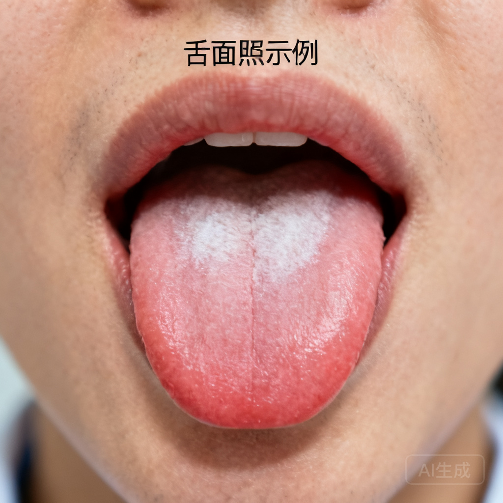
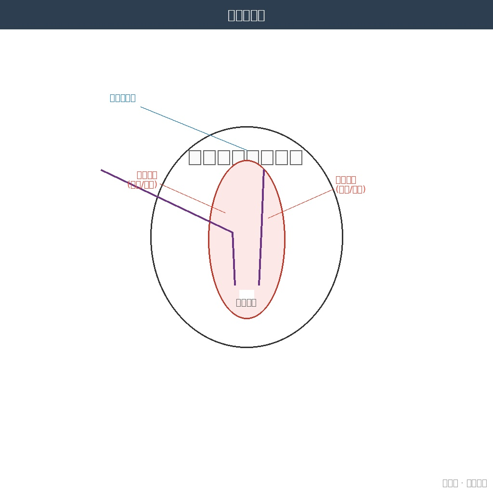
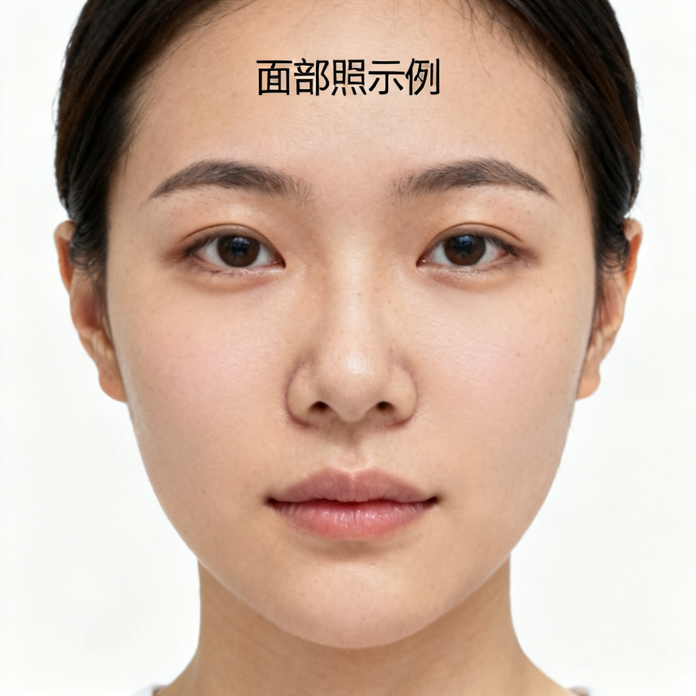
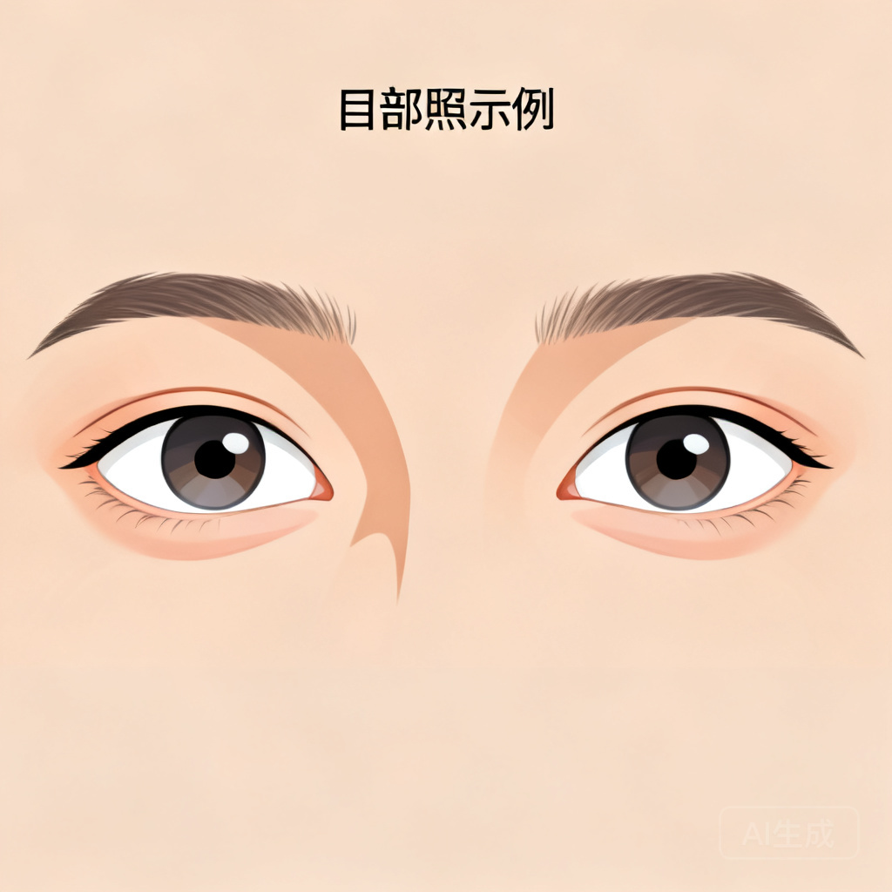
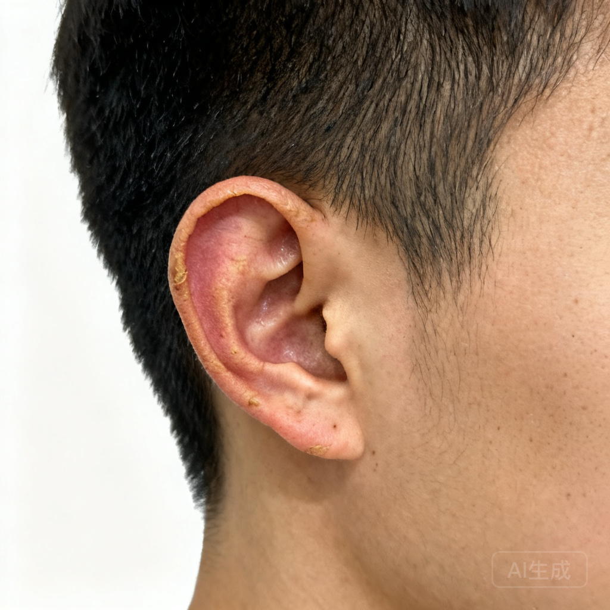
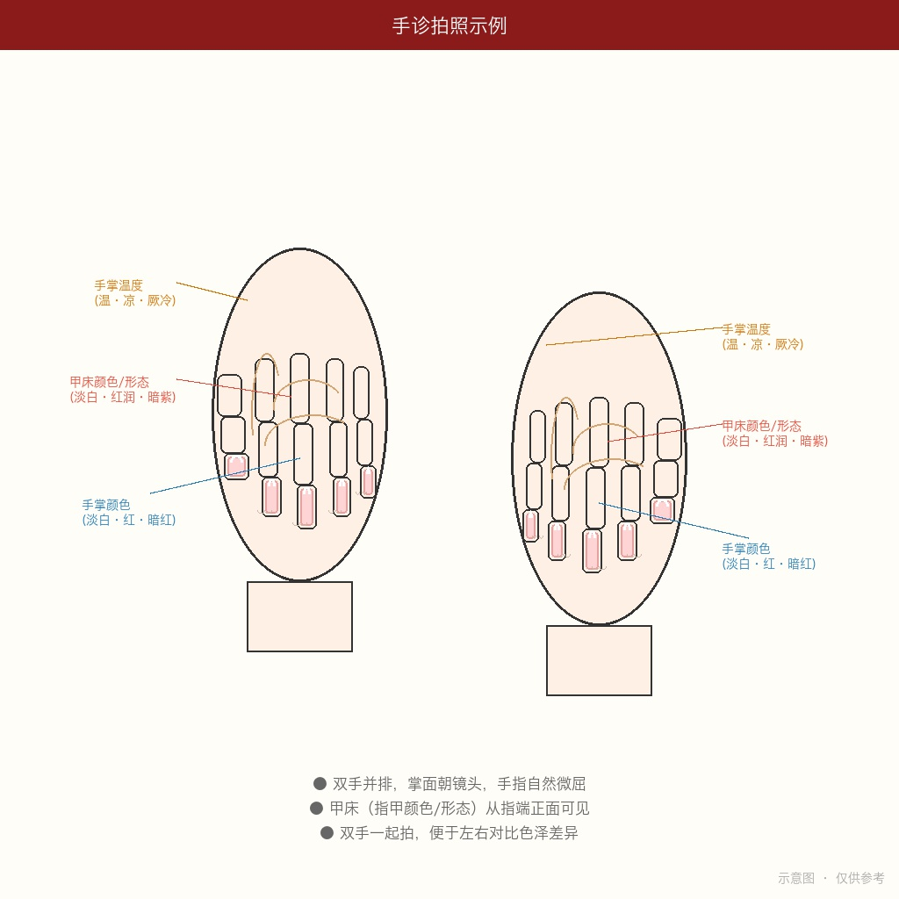
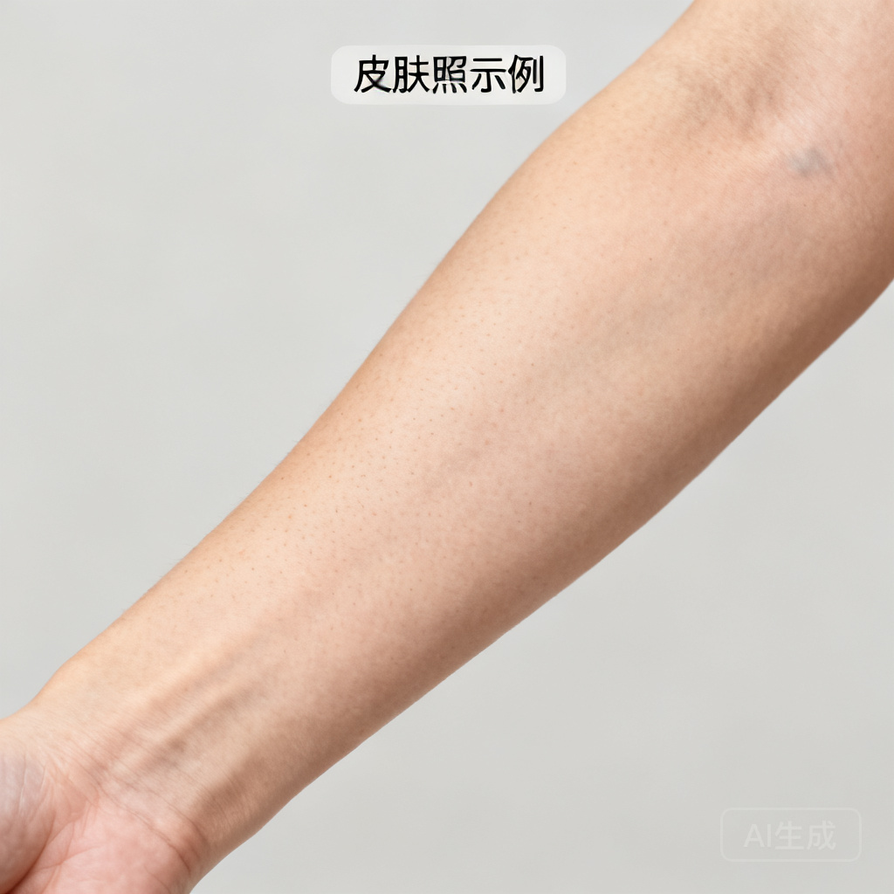

# 多维度中医望诊系统 · 使用手册

> **系统版本** v1.3.3 | 基于许家栋《经方探源》经典经方医学体系  
> **支持模型** Doubao Seed 2.0 Pro（识图）+ DeepSeek V4（辨证）

---

## 一、系统简介

本系统将传统中医"望诊"与现代 AI 视觉技术结合。你只需用手机拍摄身体不同部位的照片发送到飞书，并可选回答15项问诊问题，AI 会自动识别照片类型、提取望诊信息，结合问诊数据按照许家栋经典经方体系（三观→四证→六病）进行辨证分析。

### 核心理念

> **辨证如断案，一份证据说一分话。**
> **拍得到的拍照，拍不到的问诊，都不强求。**

- 拍 1 张照片 → 给出鉴别诊断方向（LOW，不给方剂）
- 拍 2-3 张 → 给出方剂类别建议（MEDIUM）
- 拍 4-6 张 → 给出具体方剂和剂量（HIGH）
- 问诊数据可在同一置信度内提升辨证精度，全部可跳过

---

## 二、六大拍照维度

每天你可以发送任意数量的照片。系统会根据你发送的内容自动覆盖对应维度。

### 📸 拍照总览

| # | 维度 | 照片 | 诊断价值 | 优先度 | 拍摄难度 |
|---|------|------|---------|--------|---------|
| 1 | 舌诊 | 舌面+舌底(2张) | 四证全覆盖 | ⭐⭐⭐ 核心 | 简单 |
| 2 | 头面诊 | 正面1张 | 表里观第一关+唇诊+鼻诊 | ⭐⭐⭐ 极高 | 简单 |
| 3 | 目诊 | 眼部特写1张 | 少阳病核心 | ⭐⭐⭐ 极高 | 中等 |
| 4 | 耳诊 | 侧面1张 | 少阳中风定向 | ⭐⭐ 高 | 简单 |
| 5 | 手诊 | 双手掌面1张 | 阴阳快速筛选 | ⭐⭐⭐ 极高 | 简单 |
| 6 | 皮肤诊 | 前臂内侧/小腿1张 | 太阴中风标志 | ⭐⭐⭐ 极高 | 简单 |

---

## 三、各维度拍摄指南

### 1. 舌面照

> **「伸舌自然，光线均匀，对焦清晰」**

**拍摄要点：**
- 面对自然光或白色灯光，下巴微抬
- 舌头自然平伸出，不要用力过度（避免舌色变红失真）
- 舌尖抵下唇，舌面平整可见
- 手机距离约 20cm，用主摄像头对焦舌面中央
- 拍摄前 15 分钟内不吃东西、不喝咖啡茶（避免染色）

**常见错误：**
- ❌ 舌伸太用力 → 舌色变红绛失真
- ❌ 逆光拍摄 → 舌色偏暗无法判断
- ❌ 刚喝完热茶 → 舌苔被冲刷



---

### 2. 舌底照

> **「舌尖顶上颚，充分暴露舌下」**

**拍摄要点：**
- 头后仰，嘴巴张大
- 舌尖用力顶上颚（上门牙后方），充分暴露舌下
- 手机从下往上拍，对焦舌下络脉
- 舌下两根静脉应清晰可见

**关键观察：** 络脉颜色（淡紫/青紫/紫黑）、粗细（怒张/细涩）、有无瘀点



---

### 3. 头面部照

> **「正面平视，素颜自然光，拍到完整面部+嘴唇+鼻子」**

一张正面照同时覆盖三个子区域——面域、唇域、鼻域。

**拍摄要点：**
- 正面面对相机，平视镜头
- 自然光下拍摄，不用美颜滤镜
- 露出完整面部、前额、口唇和鼻部
- 不化妆（口红、粉底遮盖真实面色和唇色）
- 表情自然放松，嘴唇自然闭合

**关键观察：**
- 面域：面色寒热（红赤/萎黄/晦暗/黧黑）、有无浮肿、光泽度
- 唇域：唇色（淡白/红/深红/紫暗）、润燥（干裂/润泽）、口周暗沉
- 鼻域：鼻色（淡白/红赤/青黑）、鼻翼煽动



---

### 4. 目部照

> **「睁大双眼，拍清白睛和下眼睑」**

**拍摄要点：**
- 双眼正视镜头，自然睁大（不要眯眼或瞪眼）
- 光线均匀照射双眼
- 可辅助用手指轻拉下眼睑，暴露结膜颜色
- 手机使用微距模式或靠近拍摄

**关键观察：** 白睛颜色（目赤程度）、眼睑浮肿（如卧蚕）、目眶暗沉、巩膜黄染



---

### 5. 耳部照

> **「侧面拍摄，耳朵完整入镜」**

**拍摄要点：**
- 头部转向一侧约 90°，露出完整外耳
- 手机从正侧面拍摄，对焦耳廓
- 光线均匀照射耳部，不要有阴影遮挡
- 拍清耳廓颜色、耳轮形态、耳垂
- 两侧耳朵各拍一张（便于对比色泽差异）

**关键观察：** 耳色（淡白/红赤/青黑）、耳轮润枯（润泽/干枯）



---

### 6. 手掌照

> **「掌面朝镜头，手指自然微屈，甲床可见」**

**拍摄要点：**
- 双手并排举在胸前，掌面朝向镜头
- 手指自然微屈（不要用力绷直），指尖朝向镜头方向
- 这个角度掌面和指甲甲床同时可见
- 光线从正上方照射，拍清手掌颜色和甲床颜色
- 最好双手一起拍（便于左右对比色泽）

**关键观察：** 手掌颜色（淡白/红/暗红）、手掌温度（由问诊获取）、甲床颜色（淡白/红润/暗紫）、甲床形态（光滑/粗糙/甲错）



---

### 7. 皮肤照

> **「前臂内侧或小腿，非暴露部位最佳」**

**拍摄要点：**
- 拍摄前臂内侧或小腿前侧（这些部位较少受日晒影响）
- 如有皮肤病灶或异常区域，单独特写
- 光线充足，避免阴影
- 可以掀起袖子/裤腿拍摄

**关键观察：** 肤色、有无甲错（干燥粗糙脱屑）、黄汗痕迹、水肿、皮疹



---

## 四、十五项问诊（全部可跳过）

拍完照片后，系统会询问你以下15个问题。**你可以跳过任意问题**——系统会基于已知信息做最佳辨证，不确定的地方会坦诚标注。

| # | 问诊项 | 选项 |
|---|--------|------|
| 1 | 恶寒or恶热？ | 恶寒 / 恶热 / 往来寒热 / 都不明显 |
| 2 | 有汗or无汗？ | 有汗 / 无汗 |
| 3 | 头痛or身痛？ | 无 / 头痛 / 身痛 / 头项强痛 |
| 4 | 口苦？ | 无 / 晨起口苦 / 全天口苦 |
| 5 | 咽干？ | 无 / 轻微 / 明显 / 咽干欲饮 |
| 6 | 目眩？ | 无 / 头晕 / 目眩(天旋地转) |
| 7 | 口渴？ | 口不渴 / 口渴欲饮 / 渴不欲饮 / 口燥但欲漱水不欲咽 |
| 8 | 食欲？ | 正常 / 纳呆不食 / 饥不欲食 / 消谷善饥 |
| 9 | 大便？ | 正常 / 便溏 / 便硬 / 便燥 / 下利 |
| 10 | 小便？ | 正常 / 小便清长 / 小便黄赤 / 小便白 / 小便不利 |
| 11 | 睡眠？ | 正常 / 失眠烦躁 / 嗜睡多寐 |
| 12 | 胸胁？ | 无不适 / 胸胁苦满 / 胸闷 |
| 13 | 腹部？ | 无不适 / 腹满 / 腹痛 / 心下痞 |
| 14 | 听力？ | 正常 / 耳鸣 / 听力下降 / 耳无所闻 |
| 15 | 鼻部？ | 正常 / 鼻塞 / 鼻鸣 / 鼻衄 |

> 💡 **提示**：问诊回答越多，辨证越精准。但完全不回答也完全可以——系统只会基于拍照信息做判断。

---

## 五、每日拍照建议

### 🏆 最佳组合（7 张，完整覆盖）

| 顺序 | 维度 | 为什么重要 |
|------|------|-----------|
| 1 | 舌面照 | 四证（水火气血）全覆盖 |
| 2 | 舌底照 | 瘀血第一窗口 |
| 3 | 头面部照 | 表里观第一关（面+唇+鼻） |
| 4 | 目部照 | 少阳病核心窗口 |
| 5 | 耳部照 | 少阳中风定向 + 津液辅助 |
| 6 | 手掌照 | 阴阳最快筛选器 |
| 7 | 皮肤照 | 太阴中风特异性标志 |

> 💡 **以上 7 张覆盖全部 6 个维度 → 达到 HIGH 置信度 → 可输出具体方剂和剂量**

### ⚡ 基础套餐（5 张，达 HIGH）

| 顺序 | 维度 | 为什么重要 |
|------|------|-----------|
| 1 | 舌面照 | 四证全覆盖 |
| 2 | 舌底照 | 瘀血窗口 |
| 3 | 头面部照 | 表里观第一关 |
| 4 | 手掌照 | 阴阳筛选器 |
| 5 | 皮肤照 | 太阴中风标志 |

> 💡 **以上 5 张覆盖 4 个维度 → HIGH 置信度 → 可输出具体方剂和剂量**

### ⚡ 快速套餐（2 张）

| 顺序 | 维度 |
|------|------|
| 1 | 舌面照 |
| 2 | 头面部照 |

> ⚠️ 仅覆盖 2 维度 → MEDIUM 置信度 → 仅给方剂类别方向，不给具体剂量

---

## 六、发送方式

1. 在飞书中打开与本助手的对话
2. 点击「+」→ 选择「相册」或「拍照」
3. 选择今日拍摄的照片（支持一次发送多张）
4. （可选）回答问诊问题，或直接说「跳过」
5. 发送后等待 AI 分析（通常 30-60 秒）

发送后系统会自动：
- 识别每张照片的部位
- 提取望诊信息
- 记录已采集的问诊项
- 构建证据矩阵
- 按置信度输出辨证报告

---

## 七、报告示例

发送 5 张照片 + 部分问诊后，你会收到这样的报告：

```
🏥 多维度中医望诊辨证报告 — 2026-06-19

📊 置信度：🟢 HIGH
   → 照片覆盖 5/6 + 问诊覆盖 10/15

📸 望诊覆盖：
  ✅ 舌诊(舌面+舌底)  ✅ 头面诊  ❌ 目诊(未拍摄)
  ✅ 耳诊  ✅ 手诊  ✅ 皮肤诊

🗣️ 问诊覆盖：
  ✅ 口苦/咽干/目眩/寒热/汗出/大便/口渴/小便/食欲/睡眠 (10/15)
  ❌ 未采集：头痛身痛/胸胁/腹满/听力/鼻部

⚠️ 因缺少以下问诊信息，以下方向无法确认/排除：
  - 胸胁苦满 → 无法排除少阳柴胡证

🔍 许家栋经方辨证结论：
  - 三观：表里观→里证为主 | 正邪观→正虚为主 | 津液观→水湿内停
  - 四证：水证中度 | 血证轻度 | 气证轻度 | 火证无
  - 六病定位：太阴病为主，兼少阴倾向
  - 核心病机：太阴里虚寒，水饮内停，营血不足

💊 方剂建议（HIGH 置信度）：
  - 主方：苓桂术甘汤
  - 合方：当归芍药散意
  - 选方依据：舌淡胖齿痕(水证)+面萎黄(血虚)+前臂甲错(伤营)
  - 核心药组：茯苓、桂枝、白术、甘草、当归、芍药
  - 剂量建议：茯苓15-30g、桂枝10-15g... ⚠️ 仅供参考

📅 明日建议：
  - 最优先补充拍照维度：目部照（区分少阳vs厥阴的关键）
  - 关键问诊项：胸胁苦满（确认/排除少阳柴胡证）
```

---

## 八、注意事项

⚠️ **安全提示：**
- 本系统为辅助参考工具，不构成医疗诊断
- 所有方剂建议请咨询执业中医师后使用
- 如出现以下体征，请立即就医：
  - 面色红如妆 + 手脚冰凉（戴阳危症）
  - 舌体短缩强硬 + 言语不利（中风先兆）
  - 极度消瘦 + 舌面光滑无苔（重症消耗）
  - 巩膜黄染 + 皮肤黄如橘皮（急性肝胆重症）

💡 **拍摄技巧：**
- 所有照片请用后置主摄像头拍摄
- 关闭美颜、滤镜功能
- 尽量在自然光下拍摄，避免强光直射
- 保持手机稳定，避免模糊

---

> **「病随机转，方从法出；以法统方，以平为期。」** —— 许家栋《经方探源》
